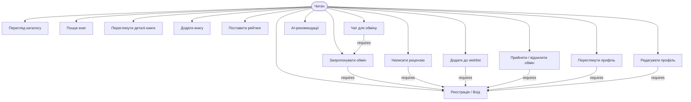
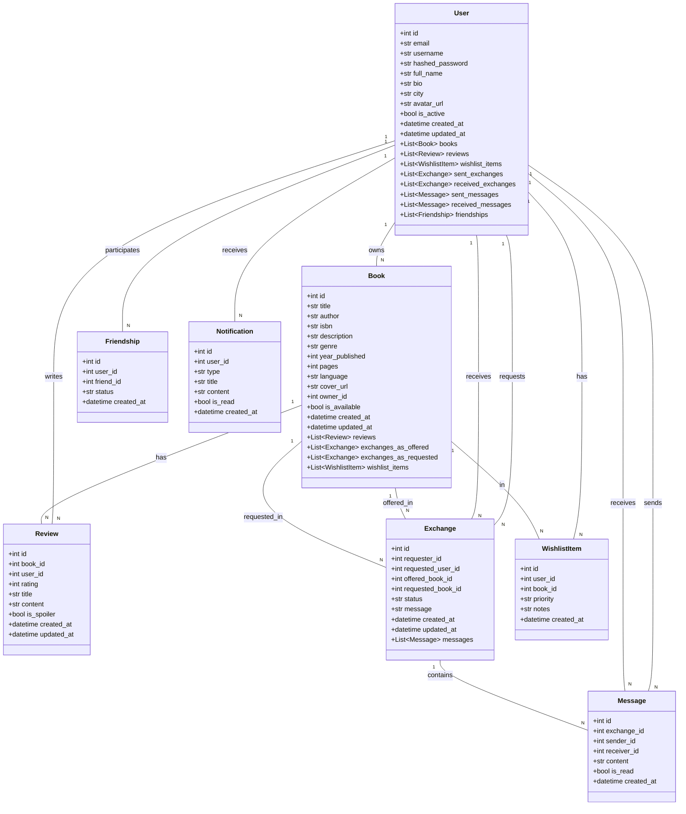
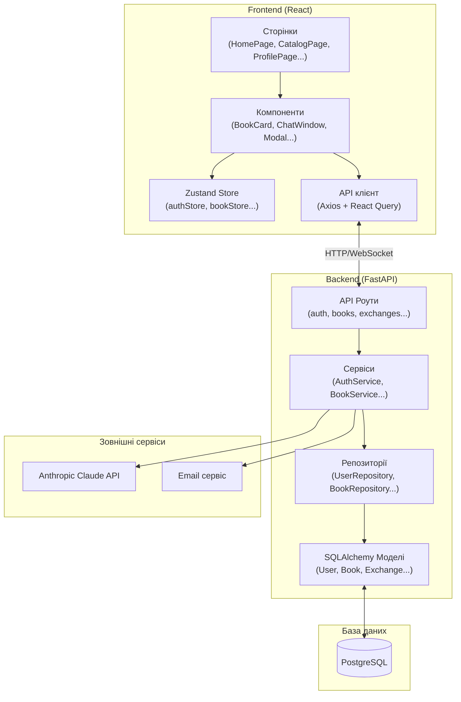
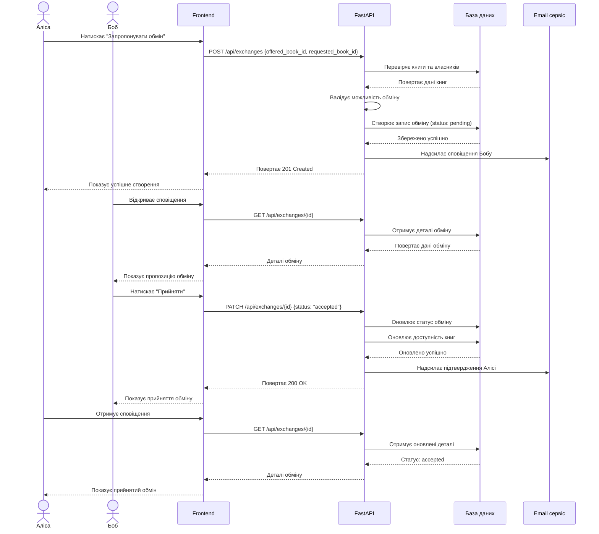
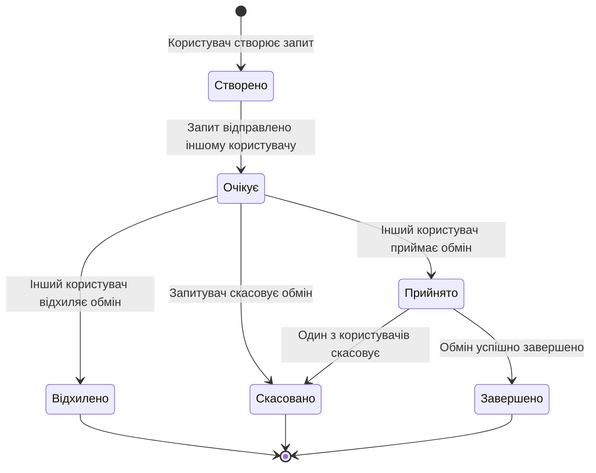
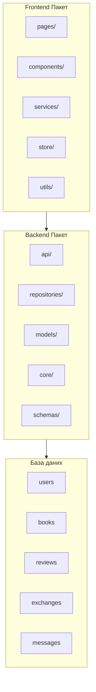
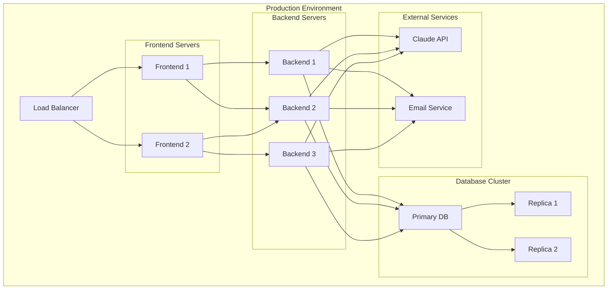

# UML Діаграми — BookSwap

Скопіюйте код у [mermaid.live](https://mermaid.live) для перегляду.

---

## 1. Діаграма варіантів використання

**Опис:**
- **Читач** - основний актор системи
- **UC1**: Реєстрація нового користувача або вхід до системи
- **UC2**: Перегляд повного каталогу книг з фільтрацією
- **UC3**: Пошук книг за назвою, автором, жанром
- **UC4**: Детальний перегляд інформації про книгу
- **UC5**: Додавання власної книги до каталогу
- **UC6**: Написання текстової рецензії на книгу
- **UC7**: Оцінка книги за шкалою 1-5
- **UC8**: Додавання книги до особистого списку бажань
- **UC9**: Створення запиту на обмін книгами
- **UC10**: Прийняття або відхилення пропозиції обміну
- **UC11**: Переговори через чат щодо деталей обміну
- **UC12**: Отримання персоналізованих рекомендацій від AI
- **UC13**: Перегляд власного профілю та статистики
- **UC14**: Редагування особистої інформації профілю

---

## 2. Діаграма класів

**Опис основних класів:**

- **User**: Користувач системи з особистою інформацією та статистикою
- **Book**: Книга з детальною інформацією та статусом доступності
- **Review**: Рецензія користувача на книгу з рейтингом
- **Exchange**: Запит на обмін книгами між двома користувачами
- **WishlistItem**: Елемент особистого списку бажань користувача
- **Message**: Повідомлення в чаті між користувачами
- **Friendship**: Дружні стосунки між користувачами
- **Notification**: Системні сповіщення для користувачів

---

## 3. Діаграма компонентів

**Опис компонентів:**

- **Frontend**: React додаток з компонентною архітектурою
- **Pages**: Сторінки рівня застосунку
- **Components**: Повторно використовувані UI компоненти
- **Store**: Управління станом через Zustand
- **API**: Клієнт для взаємодії з backend

- **Backend**: FastAPI сервер з багатошаровою архітектурою
- **Routes**: API ендпоінти та роутинг
- **Services**: Бізнес-логіка та сервісний шар
- **Repositories**: Шар доступу до даних
- **Models**: ORM моделі бази даних

---

## 4. Діаграма послідовності - Процес обміну книгами

**Опис процесу:**
1. Аліса створює запит на обмін
2. Система перевіряє доступність книг
3. Боб отримує сповіщення про пропозицію
4. Боб приймає або відхиляє обмін
5. Система оновлює статус та доступність книг
6. Обидва користувачі отримують підтвердження

---

## 5. Діаграма станів - Статус обміну

**Опис станів:**
- **Створено**: Запит обміну ініційовано
- **Очікує**: Чекає на відповідь від іншого користувача
- **Прийнято**: Обмін прийнято, очікує на завершення
- **Відхилено**: Обмін відхилено іншим користувачем
- **Скасовано**: Обмін скасовано одним з учасників
- **Завершено**: Обмін успішно завершено

---

## 6. Діаграма пакетів

---

## 7. Діаграма розгортання

**Опис розгортання:**
- **Load Balancer**: Розподіл навантаження між frontend серверами
- **Frontend Servers**: Статичні файли React додатку
- **Backend Servers**: FastAPI сервери з горизонтальним масштабуванням
- **Database Cluster**: Primary-replica конфігурація для високої доступності
- **External Services**: Зовнішні API для AI та email функціональності
