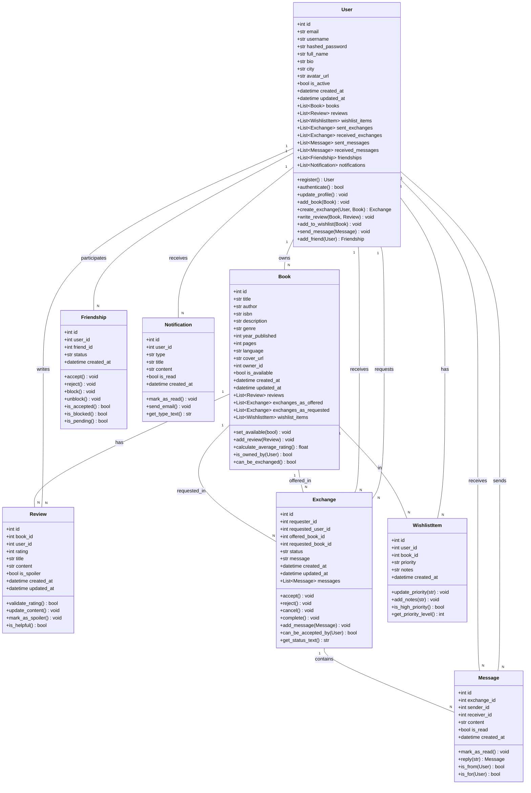
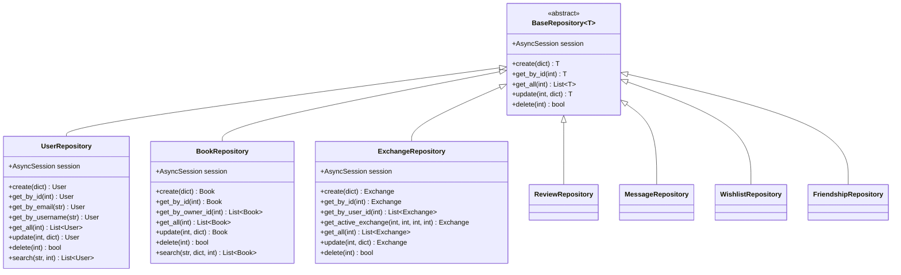
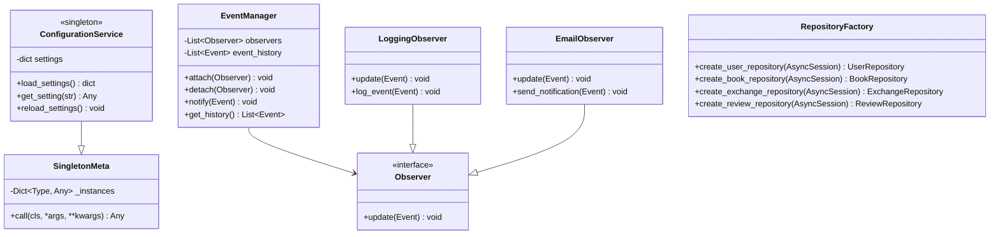
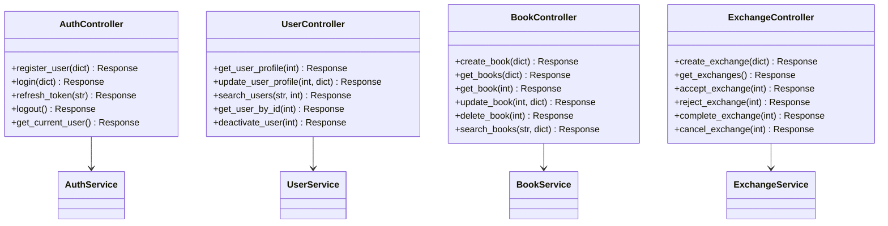

# Діаграма класів BookSwap

## Основні доменні моделі



## Сервісний шар

```mermaid
classDiagram
    class UserService {
        +UserRepository user_repo
        +EventManager event_manager
        +register_user(dict) User
        +authenticate_user(str, str) dict
        +get_user_by_id(int) User
        +update_user_profile(int, dict) User
        +search_users(str, int) List~User~
        +deactivate_user(int) bool
        +send_friend_request(int, int) Friendship
    }

    class BookService {
        +BookRepository book_repo
        +UserRepository user_repo
        +EventManager event_manager
        +create_book(int, dict) Book
        +get_book_by_id(int) Book
        +update_book(int, int, dict) Book
        +delete_book(int, int) bool
        +search_books(str, dict, int) List~Book~
        +get_user_books(int) List~Book~
        +recommend_books(int, List~str~) List~Book~
    }

    class ExchangeService {
        +ExchangeRepository exchange_repo
        +BookRepository book_repo
        +UserRepository user_repo
        +EventManager event_manager
        +create_exchange_request(int, int, int, int, str) Exchange
        +accept_exchange(int, int) Exchange
        +reject_exchange(int, int) Exchange
        +complete_exchange(int, int) Exchange
        +get_user_exchanges(int) List~Exchange~
        +cancel_exchange(int, int) bool
    }

    class ReviewService {
        +ReviewRepository review_repo
        +BookRepository book_repo
        +UserRepository user_repo
        +EventManager event_manager
        +create_review(int, int, dict) Review
        +get_book_reviews(int) List~Review~
        +update_review(int, int, dict) Review
        +delete_review(int, int) bool
        +get_user_reviews(int) List~Review~
    }

    class ChatService {
        +MessageRepository message_repo
        +UserRepository user_repo
        +EventManager event_manager
        +send_message(int, int, str) Message
        +get_conversation(int, int, int) List~Message~
        +mark_message_as_read(int, int) Message
        +get_unread_messages(int) List~Message~
        +delete_message(int, int) bool
    }

    class FriendshipService {
        +FriendshipRepository friendship_repo
        +UserRepository user_repo
        +EventManager event_manager
        +send_friend_request(int, int) Friendship
        +accept_friend_request(int, int) Friendship
        +reject_friend_request(int, int) Friendship
        +get_user_friends(int) List~User~
        +remove_friend(int, int) bool
        +block_user(int, int) Friendship
        +unblock_user(int, int) bool
    }

    class WishlistService {
        +WishlistRepository wishlist_repo
        +BookRepository book_repo
        +UserRepository user_repo
        +add_to_wishlist(int, int, str, str) WishlistItem
        +remove_from_wishlist(int, int) bool
        +get_user_wishlist(int) List~WishlistItem~
        +update_wishlist_item(int, int, dict) WishlistItem
        +get_priority_books(int) List~Book~
    }

    class AuthService {
        +UserRepository user_repo
        +EventManager event_manager
        +register_user(dict) User
        +login(dict) dict
        +get_current_user(int) User
        +refresh_token(str) dict
        +logout(int) bool
        +verify_token(str) dict
        +change_password(int, str, str) bool
    }
```



## Репозиторії



## Основні патерни



## API Шар



## Відносини між класами

```mermaid
classDiagram
    class User {
        +int id
        +str email
        +str username
        +str hashed_password
        +str full_name
        +bool is_active
        +datetime created_at
    }

    class Book {
        +int id
        +str title
        +str author
        +str isbn
        +int owner_id
        +bool is_available
        +datetime created_at
    }

    class Exchange {
        +int id
        +int requester_id
        +int requested_user_id
        +int offered_book_id
        +int requested_book_id
        +str status
        +datetime created_at
    }

    class Review {
        +int id
        +int book_id
        +int user_id
        +int rating
        +str content
        +datetime created_at
    }

    class Message {
        +int id
        +int exchange_id
        +int sender_id
        +int receiver_id
        +str content
        +bool is_read
        +datetime created_at
    }

    User ||--o{ Book : owns
    User ||--o{ Review : writes
    User ||--o{ Exchange : requests
    User ||--o{ Exchange : receives
    User ||--o{ Message : sends
    User ||--o{ Message : receives
    Book ||--o{ Review : has
    Book ||--o{ Exchange : offered
    Book ||--o{ Exchange : requested
    Exchange ||--o{ Message : contains
```

**Опис відносин:**

- **User ↔ Book**: Один користувач може володіти багатьма книгами (одна книга належить одному користувачу)
- **User ↔ Review**: Один користувач може написати багато рецензій (одна рецензія написана одним користувачем)
- **User ↔ Exchange**: Один користувач може створювати багато запитів на обмін (один обмін ініційований одним користувачем)
- **Book ↔ Review**: Одна книга може мати багато рецензій (одна рецензія належить одній книзі)
- **Exchange ↔ Message**: Один обмін може містити багато повідомлень (одне повідомлення належить одному обміну)

## Методи та операції

### User методи
- `register()` - Реєстрація нового користувача
- `authenticate()` - Автентифікація користувача
- `update_profile()` - Оновлення профілю
- `add_book()` - Додавання книги до власності
- `create_exchange()` - Створення запиту на обмін

### Book методи
- `set_available()` - Встановлення статусу доступності
- `add_review()` - Додавання рецензії
- `calculate_average_rating()` - Розрахунок середнього рейтингу
- `can_be_exchanged()` - Перевірка можливості обміну

### Exchange методи
- `accept()` - Прийняття обміну
- `reject()` - Відхилення обміну
- `complete()` - Завершення обміну
- `cancel()` - Скасування обміну

### Review методи
- `validate_rating()` - Валідація рейтингу
- `update_content()` - Оновлення вмісту рецензії
- `mark_as_spoiler()` - Позначення як спойлер

### Message методи
- `mark_as_read()` - Позначення як прочитане
- `reply()` - Відповідь на повідомлення
- `is_from()` - Перевірка відправника

### Friendship методи
- `accept()` - Прийняття дружби
- `reject()` - Відхилення дружби
- `block()` - Блокування користувача
- `unblock()` - Розблокування користувача

## Валідація та обмеження

### User валідація
- Email: унікальний, валідний формат
- Username: унікальний, 3-50 символів
- Password: мінімум 8 символів
- Full name: необов'язкове, макс 100 символів

### Book валідація
- Title: обов'язкове, макс 200 символів
- Author: обов'язкове, макс 100 символів
- ISBN: унікальний, валідний формат ISBN-10/13
- Year published: 1900-поточний рік
- Pages: позитивне число, макс 10000

### Exchange валідація
- Requester та requested user не можуть бути однією людиною
- Offered та requested книги не можуть бути однаковими
- Книги повинні бути доступні для обміну

### Review валідація
- Rating: 1-5 (ціле число)
- Content: макс 2000 символів
- Title: макс 100 символів
- Один користувач може написати лише одну рецензію на книгу

### Message валідація
- Content: обов'язкове, макс 1000 символів
- Відправник та отримувач не можуть бути однією людиною
- Повідомлення пов'язане з існуючим обміном
